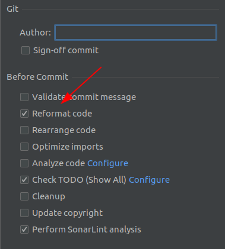

<!-- START doctoc generated TOC please keep comment here to allow auto update -->
<!-- DON'T EDIT THIS SECTION, INSTEAD RE-RUN doctoc TO UPDATE -->
# Table of contents

- [How to contribute](#how-to-contribute)
  - [Answering questions and writing documentation](#answering-questions-and-writing-documentation)
  - [Submitting changes](#submitting-changes)
  - [Coding conventions](#coding-conventions)
    - [SonarLint](#sonarlint)
    - [Commit messages](#commit-messages)

<!-- END doctoc generated TOC please keep comment here to allow auto update -->

# How to contribute

We're really glad you're reading this, because we need more volunteer developers to help with this
project!

We can use all the help we can get on each of
our [GraphQL Java Kickstart](https://github.com/graphql-java-kickstart)
projects. This work ranges from adding new features, fixing bugs, and answering questions to writing
documentation.

## Answering questions and writing documentation

A lot of the questions asked on GitHub are caused by a lack of documentation. We should
strive from now on to answer questions by adding content to
our [documentation](https://github.com/graphql-java-kickstart/documentation) and referring them to
the newly created content.

Continuous integration will make sure that the changes are automatically deployed to
https://www.graphql-java-kickstart.com.

## Submitting changes

Please send a Pull Request with a clear list of what you've done using the
[GitHub flow](https://guides.github.com/introduction/flow/). We can always use more test coverage,
so we'd love to see that in the pull requests too. And make sure to follow our coding conventions (
below) and make sure all your commits are atomic
(one feature per commit).

## Coding conventions

We use Google Java Style guide for our projects. See the
[Java Style Guide](https://google.github.io/styleguide/javaguide.html) for a detailed description.
The code style is enforced in our CI workflows. This means you'll have to make sure that your
commits have the same formatting.

Best way to do this is to install the
[google java format plugin](https://plugins.jetbrains.com/plugin/8527-google-java-format). Once
installed you'll have to enable it for the project. From that point on you can hit CTRL+ALT+L to
reformat the code. Or even better configure the commit options in IntelliJ IDEA to Reformat Code
before commit:

**Warning**
There's also an XML code style file available that you could import in your IDE. That approach will
never be exactly in line with the checks and formatting that the google-java-format plugin applies.

### SonarLint

It would also be very helpful to install the SonarLint plugin in your IDE and fix any relevant
SonarLint issues before pushing a PR. We're aware that the current state of the code raises a lot of
SonarLint issues out of the box, but any help in reducing that is appreciated. More importantly we
don't increase that technical debt.

### Commit messages

This project uses the [Conventional Commits](https://www.conventionalcommits.org) specification for commit messages.
The CI pipeline validates that commit messages adhere to the specification using 
[commitlint](https://github.com/conventional-changelog/commitlint).

**Note**: *Historical commits, made before applying this convention may not fulfill the requirements of the 
specification. These commits are exempt from this check.*

To check commit messages before committing, go to the `commitlint` folder and run `npm ci && npm run add-commitlint-git-hook` 
(you will need NodeJS installed on your machine). This command sets up a git hook to run commitlint before each commit,
to prevent committing with invalid commit messages in the first place.

**Note**: *Please always use `npm ci` instead of `install` to prevent unwanted changes to `package-lock.json`.*

To remove the git hook, just delete the `commitlint/.husky` folder.

As for the optional scope part of the commit message:
- if your commit addresses an issue, please refer the issue number in the scope - e.g. `fix(#123): ...`
- otherwise, if applicable, please refer to the added or modified feature - e.g. `feat(webflux): ...`  

